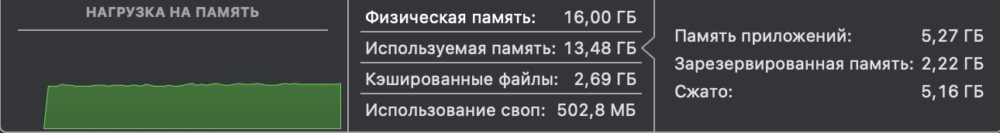
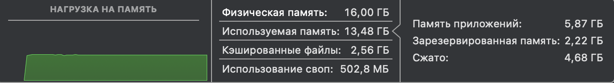
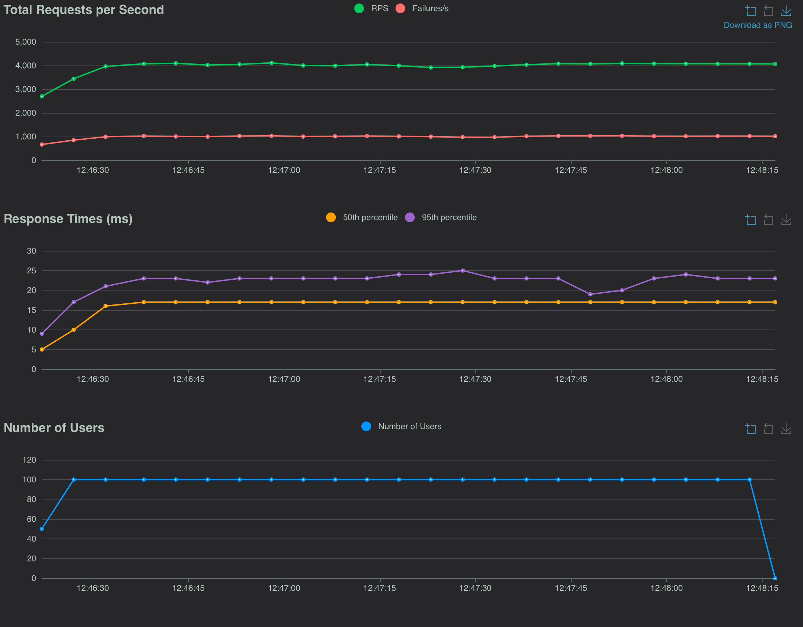

## Как запустить нагрузочный тест??

```

cd Task4 # Если находишься в корне проекта

chmod +x load_test.sh # Необходимо убедиться, что bash файл исполняемый

./load_test.sh

```

После запуска, в течение 30 секунд будет проходить тест максимум на 100 пользователей.
После окончания статистику можно проверить в файле stat.html.
Cтатистику теста, который я проводил локально у себя, расположена в файле my_stat.html.

Далее идут мои наблюдения:

- В начале роста нагрузки можно заметить резкий рост потребления ЦП и кол-во потоков.


- После окончания уменьшения кол-ва потоков, выделяемых для пользователей.


- Оперативная память в начале не особо сильно меняется.



- Так и после завершения теста.



- В течение всего теста, кол-во запросов стабильно держится. А вот время отклика ближе к середине графика увеличивается из-за нагрузки на ЦП.



Вывод: Симуляция пользователей в большей мере влияет на ЦП, конкретно на многопоточность

